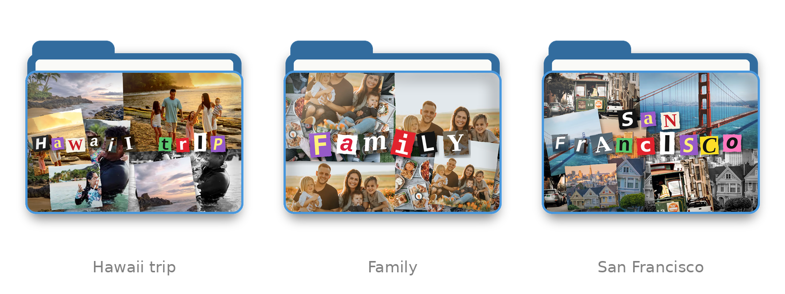

# 🪄 📁 Folder Collage

**Remember the 2000s school folders? You can now turn any Mac folder's icon into a scrapbook collage of the photos inside it.**

Install macOS action  → right-click on your photos folder → **Collage it**. That's it.



- Photos are cut, layered and glued edge to edge, with tilted prints, magazine-style cut-outs and the odd black-and-white photo-booth shot.
- The folder name is spelled out in **ransom-note letters**.
- A **laminated plastic sheen** on top finishes the look.
- Every run is a new shuffle — don't like it? Run it again.

---

## Requirements

- macOS 12 Monterey or newer (Apple Silicon or Intel)
- **Python 3.10 or newer** — get it from [python.org](https://www.python.org/downloads/macos/) or with `brew install python`.
  The Python that comes with Apple's developer tools (3.9) is too old for the current, security-patched version of the image library.

## Install

1. **Download** this repository: green **Code** button → **Download ZIP**, then unzip it.
2. **Double-click `Install Folder Collage.command`.**

  ⚠️ macOS will warn that it *"could not verify … is free of malware"*. This happens for every script that isn't signed with a paid Apple developer certificate. You can [read the installer](Install%20Folder%20Collage.command) first — it's short. To continue, pick one:

   - **Option A:** click **Done**, open **System Settings → Privacy & Security**, scroll to the bottom and click **Open Anyway** next to the installer, then double-click it again.
   - **Option B:** open **Terminal**, type `bash ` (with a space), drag the installer into the window and press **Return**.

3. Wait for **"✅ Done!"** — about a minute the first time.

The installer puts everything in `~/Library/Application Support/FolderCollage` (a private Python environment, so nothing else on your Mac is changed) and adds two Finder Quick Actions. It doesn't use `sudo` or need your admin password.

## Use

| To… | Do this |
|---|---|
| Make a collage icon | Right-click a folder → **Quick Actions → Collage it** |
| Get a different shuffle | Run **Collage it** again |
| Go back to the normal folder | Right-click → **Quick Actions → Remove collage** |
| Do several at once | Select multiple folders, then right-click |

The first time, macOS may ask whether Folder Collage can access a folder such as **Desktop**, **Documents** or **Downloads**. That's needed to read the photos — allow it. **It never needs Full Disk Access**, so don't grant that.

### What ends up in the collage

| Folder contains | Result |
|---|---|
| Lots of photos | Up to 14 picked at random, from the folder and up to two levels of subfolders |
| A single photo | Several different crops of that one photo |
| Mostly documents | Quick Look previews of PDFs, Word, Pages, Keynote files and videos fill in |
| Nothing usable | Icon left alone; a notification tells you why |

Supported photo formats: JPEG, PNG, HEIC/HEIF (iPhone), WebP, TIFF, BMP, GIF.

## Troubleshooting

**"Collage it" isn't in the right-click menu**

1. Check the very bottom of the right-click menu — on some macOS versions it's listed under **Services**.
2. Right-click any folder → **Quick Actions → Customize…** and tick **Collage it** and **Remove collage**.
3. Still missing? In Finder press **⇧⌘G**, go to `~/Library/Services`, double-click **Collage it.workflow** and choose **Install** (or press **⌘S** if it opens in Automator). Repeat for **Remove collage.workflow**, then relaunch Finder (hold **⌥**, right-click Finder in the Dock → **Relaunch**).

You can also find the switch in **System Settings → Keyboard → Keyboard Shortcuts…** (it's a button) **→ Services → Files and Folders**.

**"Couldn't set the icon"** — the folder is probably on a read-only disk, a network share, or a cloud folder that doesn't keep custom icons.

**Installer says Python 3.10 is needed** — install it from [python.org](https://www.python.org/downloads/macos/), then run the installer again.

## Privacy

Everything happens on your Mac. Folder Collage makes **no network connections** — the only download is the image library, from PyPI, during install.

One thing to know: the collage is saved **inside the folder** as its custom icon. If you share the folder — AirDrop, zip, a USB stick, a synced cloud folder — the icon goes with it, so people can see small versions of the photos (including ones in subfolders) before opening it. Use **Remove collage** first if that matters, or run it from Terminal with `--no-subfolders`.

## Command line

Prefer the terminal? The Quick Action is a thin wrapper around one script:

```bash
~/Library/Application\ Support/FolderCollage/collage ~/Pictures/Summer
```

| Option | What it does |
|---|---|
| `--seed N` | Same collage every time for a given number |
| `--no-title` | No cut-out letters |
| `--no-subfolders` | Only use photos directly in the folder |
| `--no-documents` | Never use document previews |
| `--tint R,G,B` | Folder color, e.g. `220,90,90` |
| `--preview out.png` | Render to a PNG without touching the folder |
| `--reset` | Restore the normal icon |

## Uninstall

Double-click **`Uninstall Folder Collage.command`** (the same macOS warning applies). Folders you've already collaged keep their icon — use **Remove collage** on them first if you want them back to normal.

## Security

Folder Collage reads your photos and changes folder icons, so it's built defensively. See **[SECURITY.md](SECURITY.md)** for what it can and can't do, how untrusted images are handled, and how to report a problem.

## License

[MIT](LICENSE)
