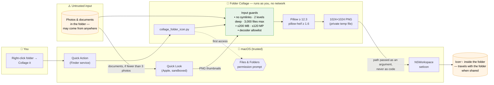
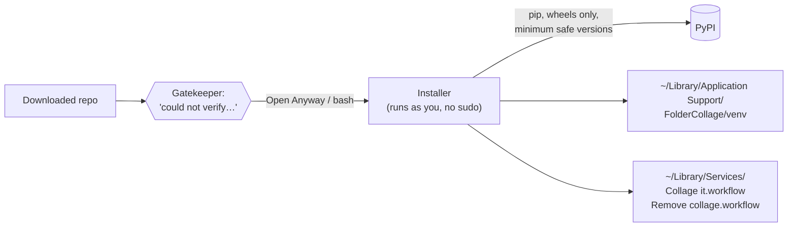

# Security

Folder Collage reads the photos in folders you choose and changes those folders' Finder icons. Because it runs on your Mac, asks for file-access permission, and opens images that may have come from anywhere, it is built defensively. This page explains what it can and can't do, how it protects you, and the risks that remain.

**Found a problem?** Please open a [private security advisory](../../security/advisories/new) on this repository instead of a public issue.

---

## At a glance

- **Runs only as you.** No admin password, no `sudo`, nothing installed system-wide.
- **No network.** The tool never connects to the internet. The installer downloads the image library from PyPI once.
- **Minimal permissions.** It only needs macOS's standard *Files and Folders* access, and only for folders you collage. It **never** needs Full Disk Access, Accessibility, Screen Recording or control of other apps.
- **Read-only on your photos.** Images are opened for reading, never changed, moved or deleted.
- **Treats every file as untrusted**, with patched libraries, a short list of allowed formats, and size limits (see [How it protects you](#how-it-protects-you)).

## What it can and cannot do

| Capability | Used? | Detail |
|---|---|---|
| Read files | ✅ | Only inside the folder(s) you right-click, plus up to two levels of subfolders. Symbolic links are not followed. |
| Write files | ✅ | The folder's custom icon (macOS stores it as a hidden `Icon␍` file inside the folder), and a temporary file in your private temp directory that is deleted immediately. The installer writes to `~/Library/Application Support/FolderCollage` and `~/Library/Services`. |
| macOS "Files and Folders" permission | ⚠️ prompt | macOS asks the first time you collage something in Desktop, Documents, Downloads, iCloud Drive, or on an external or network drive. Needed to read the photos. |
| Notifications | ⚠️ optional | Shows a one-line result. You can deny it and everything still works. |
| Network | ❌ | No connections, ever. Only the installer contacts PyPI. |
| Admin password / `sudo` | ❌ | Never. |
| Full Disk Access, Accessibility, Screen Recording, Automation | ❌ | Never requested or needed. **If anything asks for these in Folder Collage's name, deny it.** |
| Modify or delete your photos | ❌ | Never. |

## How data flows

The orange boxes are untrusted: **anything inside a folder is treated as potentially hostile**, because people collage folders of photos they downloaded, received over AirDrop or got from a USB stick.

Installation is a separate, one-time flow:

## How it protects you

### Patched image libraries

| Library | Required version | Why |
|---|---|---|
| [Pillow](https://pypi.org/project/pillow/) | **≥ 12.3.0** | First release that includes all published fixes, including memory-safety issues in `paste()`, `crop()` and `alpha_composite()` ([CVE-2026-59199](https://github.com/advisories/GHSA-6r8x-57c9-28j4)), which this tool uses, and in ImageCms ([CVE-2026-59205](https://github.com/advisories/GHSA-9hw9-ch79-4vh6)). See the [Pillow advisory list](https://github.com/python-pillow/Pillow/security/advisories). |
| [pillow-heif](https://pypi.org/project/pillow-heif/) *(optional, for HEIC)* | **≥ 1.6.0** | Bundles libheif 1.23.1, which fixes the HEIF decoding issue [CVE-2026-62289](https://security-tracker.debian.org/tracker/CVE-2026-62289); also includes the fix for [CVE-2026-28231](https://vulert.com/vuln-db/pillow-heif-integer-overflow-in-encode-path-buffer-validation-leads-to-heap-out-of-bounds-read) and a use-after-free fix ([changelog](https://github.com/bigcat88/pillow_heif/blob/master/CHANGELOG.md)). |

Current Pillow releases need **Python 3.10 or newer**. The installer checks for this and stops with instructions if only Apple's built-in Python 3.9 is available, because Python 3.9 can only install an older, unpatched Pillow. It prints the installed Pillow version at the end, so you can confirm it.

### Only the image formats it needs

Pillow recognizes files by their contents, not their name, and supports dozens of formats. Left unrestricted, a file named `holiday.jpg` that actually contains an obscure format would be handed to a rarely used decoder. Historically, most image-library vulnerabilities have been found in those decoders.

Folder Collage only allows these decoders: **JPEG (including multi-picture camera JPEGs), PNG, WebP, TIFF, BMP, GIF and HEIF**. Any other file is skipped before a decoder runs. Quick Look thumbnails are opened as PNG only.

### Size and resource limits

| Limit | Value |
|---|---|
| File size | Files over **200 MB** are skipped |
| Image dimensions | Images over **120 megapixels** are skipped. Pillow's decompression-bomb warning is treated as an error, so a tiny file claiming to be enormous is rejected, not decoded. An iPhone 48 MP photo is well under the limit. |
| Decoding | JPEGs are decoded at reduced size, and everything is shrunk to ≤ 1400 px right away |
| Folder scan | Two subfolder levels, 3,000 files, 14 images at most |
| Document previews | Quick Look is given a 60-second timeout |

### No code injection

To set the icon, the tool runs a short, **fixed** JavaScript for Automation snippet through `osascript`. Folder paths and notification text are passed to it as separate arguments and read with `run(argv)`. They are never inserted into the script, so even a deliberately strange folder name is only ever treated as a name. No shell is involved: every external command is run with an argument list.

### Safe file handling

- Symbolic links are never followed, so nothing outside the folder ends up in its icon.
- The temporary icon file is created privately (`mkstemp`, permissions 0600) and deleted in a `finally` block, even if setting the icon fails.
- Hidden files, app bundles and Photos libraries are skipped.

### Careful installation

- Everything is installed into a private Python virtual environment in `~/Library/Application Support/FolderCollage`. System Python and other projects are untouched.
- `pip` runs with `--only-binary=:all:`, so only prebuilt packages are installed and no package build scripts run on your Mac.
- No `sudo` and nothing outside your home folder.

## Known limitations

These are inherent to how the tool works, or depend on things outside its control.

**The icon travels with the folder.** The collage is saved inside the folder, so copying, zipping, AirDropping or syncing it (iCloud Drive, Dropbox) carries the icon along. Anyone who sees the folder sees small versions of up to 14 of its photos, including ones from subfolders, and its name in large letters. Use **Remove collage** before sharing if that matters, or `--no-subfolders` to limit the collage to the top level.

**Future image-library bugs.** Patched libraries and the format allowlist reduce the risk, but an undiscovered bug in a supported decoder could still be triggered by a crafted image. The impact would be limited to your user account. Re-running the installer always fetches the newest patched versions.

**Unsigned installer.** The `.command` files aren't signed or notarized by Apple, so macOS shows a *"could not verify"* warning and you have to choose **Open Anyway**. The scripts are short plain text, so please [read them](Install%20Folder%20Collage.command) before running, and only download from this repository.

**Dependencies come from PyPI.** The installer downloads Pillow and pillow-heif at install time. Versions are minimums rather than exact hashes, so you get future security fixes automatically, at the cost of trusting PyPI and those projects for each install.

**Document previews.** When a folder has fewer than three photos, Apple's Quick Look renders previews of its documents. This is the same Apple code Finder uses in icon view, and it is sandboxed by macOS. Use `--no-documents` to turn it off.

**Install folder is yours.** `~/Library/Application Support/FolderCollage` and `~/Library/Services` belong to your account. Any program already running as you could change them, but that program could already do anything you can, so this doesn't give it extra power.

## Verification

Each release is checked by:

- reviewing every line of the script, installer, uninstaller and generated Quick Actions for injection, path, temp-file, symlink and resource-exhaustion issues
- checking the minimum dependency versions against the GitHub Advisory Database, NVD and the Debian security tracker
- loading every supported format in its common variants (progressive and CMYK JPEG, rotated photos, 16-bit and palette PNG, animated GIF, transparent WebP, TIFF, BMP)
- testing the protections directly: a non-allowed format disguised as `.jpg` is rejected, a 225-megapixel decompression bomb is rejected, and a symlink to an outside image is ignored. Normal, single-photo and empty folders also behave as documented.
- validating the Quick Action property lists and checking the shell scripts' syntax

Planned: [ShellCheck](https://www.shellcheck.net/) and [Bandit](https://bandit.readthedocs.io/) in CI, fuzzing the image-loading path, and an end-to-end permission test on a clean macOS install.

*Dependency status last checked: 3 October 2026.*

## Supported versions

Only the latest version on the `main` branch is supported. To update, download the repository again and re-run the installer.
